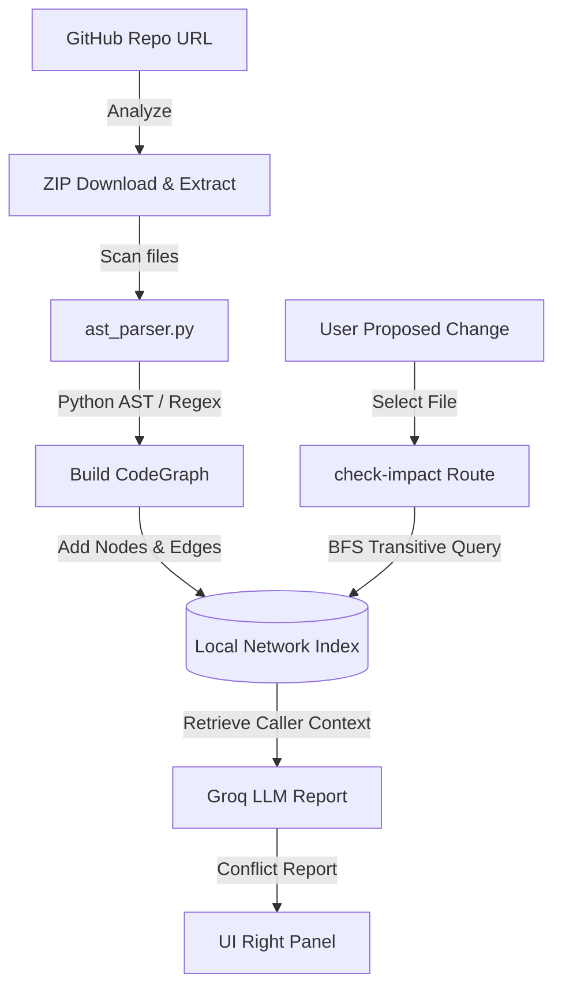

# AI Code Debugger & Learning Platform 🚀

A comprehensive, production-ready developer platform providing self-correcting debugging, educational code generation, and codebase dependency impact analysis using **Graph-RAG** and **Multi-Language AST/Regex Parsing**.

---

## Key Features

### 🐛 Bug Debugger (Python)
- Analyzes error stack traces and automatically predicts the crash category using a PyTorch classifier.
- Searches a local RAG vector store for relevant concept guides.
- Employs a **Self-Correcting Execution Sandbox Loop** that runs code in a secure subprocess, intercepts output/stderr, and auto-corrects code up to 3 times before returning the final solution.

### 💡 CS Concept & Code Generator (Multi-Language)
- Generates functional, optimized source code (Python, C++, Java, JS, Go, Ruby) based on user prompts.
- Appends detailed algorithmic tutorials including computer science principles and Big-O Time/Space complexity analysis.

### 📊 GitHub Repository Analyzer (Graph RAG)
- Fetches public repositories from GitHub as zip archives, extracting structural files.
- Builds a **Local Code Dependency Network Graph** mapping imports, class structures, base class inheritances, functions, and method calls.
- Supports **multi-language parsing** using:
  - High-fidelity **Abstract Syntax Trees (AST)** for Python (`.py`, `.ipynb` Jupyter cells).
  - Robust **IPython Magic Filters** (comments out `%` or `!` lines to keep parsing clean).
  - Regex-based syntax parsers for **JS/TS**, **Java**, **C/C++**, **Go**, and **Ruby**.
- Runs downstream impact checks: select a file, mock a code update, trace the call paths inwards using Breadth-First Search (BFS), and receive an LLM software architect breakage report.

---

## Project Structure

```
├── agent/
│   ├── core.py             # DebugAgent & GenerationAgent implementation
│   └── tools.py            # Classification, doc retrieval, sandbox runner
├── classifier/
│   ├── model.py            # PyTorch ErrorClassifier
│   ├── predict.py          # Classifies trace inputs via embeddings
│   └── train.py            # Training routines (40+ standard exceptions)
├── repo_analyzer/
│   ├── ast_parser.py       # Multi-language files AST & regex parser
│   ├── graph_rag.py        # Local network dependency graph builder
│   └── routes.py           # GitHub downloader & analyzer routes
├── rag/
│   ├── loader.py           # Doc parser and ChromaDB indexing
│   └── embedder.py         # Embedding generation and query retrieval
├── data/docs/              # Markdown conceptual reference books
├── static/
│   ├── index.html          # Interactive Tab-based Workspace
│   ├── style.css           # Premium Light Theme stylesheet
│   └── app.js              # Event logic & Markdown code-block renderer
├── main.py                 # FastAPI Web & API Application Boot
└── scratch_test.py         # Programmatic verification validation tests
```

---

## System Design & Graph RAG Architecture



---

## Setup & Execution

### 1. Prerequisites
Ensure you have Python 3.10+ installed.

Set your Groq API Key in a `.env` file in the project root:
```env
GROQ_API_KEY=gsk_...
```

### 2. Install Dependencies
```bash
pip install -r requirements.txt
```

### 3. Run Programmatic Tests
To verify all agents, RAG collections, and multi-language notebook parsers operate correctly, execute the verification script:
```bash
python scratch_test.py
```

### 4. Start the Application
Boot up the FastAPI production server:
```bash
python main.py
```
Or use uvicorn:
```bash
uvicorn main:app --reload
```

Access the frontend dashboard at `http://127.0.0.1:8000`.
